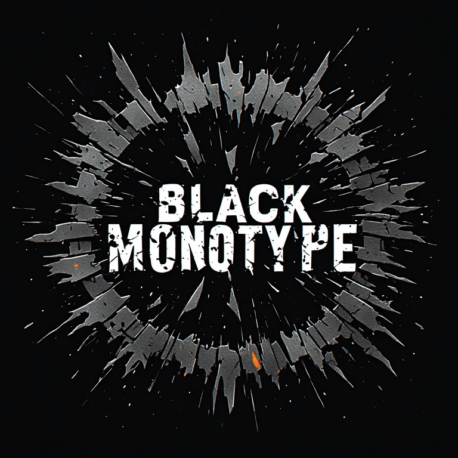

  <!-- Logo Asset: Make sure your uploaded file matches this filename -->
  

   

  

    <strong>Horror UI Design • Atmospheric Web Architecture • Front-End Engineering</strong>
  

  

    
    
    
    
  

---

### 👁️ Manifest

**Black Monotype** is a creative front-end design studio dedicated to subverting clean, sterile interfaces in favor of atmospheric weight, visceral tension, and tactile dread. 

Specializing in native browser technologies—**HTML5, modern CSS, and vanilla JavaScript**—I architect experiences where interfaces bleed, flicker, and decay with deliberate mechanical precision.

---

### 🎛️ Specialized Front-End Disciplines

<table>
  <tr>
    <td width="33%" valign="top">
      <h4>🏛️ Semantic Architecture</h4>
      <ul>
        <li>Strict, accessible <strong>HTML5</strong> DOM structures</li>
        <li>Micro-data & modular component scaffolds</li>
        <li>Subverting traditional layouts for atmospheric tension</li>
      </ul>
    </td>
    <td width="33%" valign="top">
      <h4>🕯️ Atmospheric Styling</h4>
      <ul>
        <li>Advanced <strong>CSS Grid</strong> & dynamic Subgrid layouts</li>
        <li>SVG displacement filters & blend modes</li>
        <li>CRT scanlines, chromatic aberration, & noise grain</li>
      </ul>
    </td>
    <td width="33%" valign="top">
      <h4>⚙️ Procedural Behavior</h4>
      <ul>
        <li><strong>Vanilla JavaScript</strong> micro-interactions</li>
        <li>HTML5 Canvas API rendering & custom shaders</li>
        <li>Procedural distortion, state decay, & custom input engines</li>
      </ul>
    </td>
  </tr>
</table>

---

### 🔬 Technical Principles

* **Core Stack:** Semantic HTML5 • Advanced Modern CSS • Vanilla JavaScript
* **Aesthetic Focus:** Dark Industrial • Tactile Analog • Psychological Horror UI
* **Core Tenets:**
  * No bloated frameworks when raw DOM and CSS can carry the dread.
  * Form follows atmosphere; every interaction must convey weight.
  * Tactile digital decay over flat, sterile trends.

---

### 📡 Featured Lab & Experimental Works

* 🌑 **Atmospheric UI Components** — Reusable, accessible darkroom-grade interface modules built with pure CSS & minimal JS.
* 📺 **Analog Noise & Scanline Engines** — Procedural distortion, CRT flickering, and authentic phosphor decay in the browser.
* 🕷️ **Tactile Typography & Layouts** — Monolithic typography experiments engineered for psychological suspense.

---

  Designed & engineered under the Black Monotype imprint. Form follows dread.

